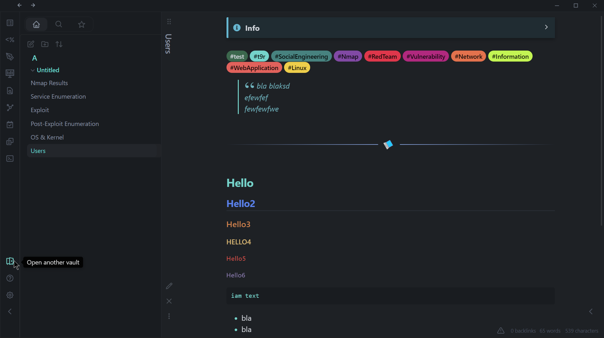

# T9R

### Notes on this theme

This theme was built using code from **@colineckert's** great Thing theme. Please support @colineckert's work!

Support **@colineckert** on [Twitter](https://twitter.com/colineckert) or [Buy @colineckert a coffee](https://www.buymeacoffee.com/colineckert)

## Features

- Te9Realms-inspired color palette
- Light and dark theme
- Quick preview/edit floating action button on mobile
- Customizable colors for bold, italic, highlighters, and block-quotes
- Atom code syntax higlighting
- Tag pills for readability
- Minimal icons
- Better designed image cards
- Bullet and number list relationship lines
- Fancy cursor based on Things cursor color
- Publish and Sync support
- [JetBrains Mono](https://www.jetbrains.com/lp/mono/) font and ligatures for code
- Stylish Blockquotes

## Supported Plugins

This theme has support for the following Obsidian community plugins:

- [Sliding Panes (Andy's Mode)](https://github.com/deathau/sliding-panes-obsidian)
- [Calendar](https://github.com/liamcain/obsidian-calendar-plugin)
- [Kanban](https://github.com/mgmeyers/obsidian-kanban)
- [Hider](https://github.com/kepano/obsidian-hider)
- [Checklist](https://github.com/delashum/obsidian-checklist-plugin)
- [Todoist](https://github.com/jamiebrynes7/obsidian-todoist-plugin) (ironic, I know)
- [Style Settings](https://github.com/mgmeyers/obsidian-style-settings)
- [Advanced Mobile Toolbar](https://github.com/phibr0/obsidian-advanced-toolbar)

## Installation

### Obsidian Marketplace (Recommended)

1. Open the **Settings** in Obsidian
1. Navigate to **Appearances** tab under **Options**
1. Under the **Themes** section, click on the `Manage` button across from **Themes**
1. Search for `Things` in the Filter text input
1. Click `Use` and then you're done! 🎉

### Manual

1. Download this repo
1. Copy the `obsidian.css` file into your vault's `/.obsidian/themes` directory
1. Rename the file to `T9R.css` so it will have a unique name in the theme selection dropdown
1. Open the **Settings** in Obsidian
1. Navigate to **Appearances** tab under **Options**
1. Under the **Themes** section, click on the dropdown menu next to **Theme** heading
1. Select `T9R` and then you're done! 🎉

## Feedback

If you have any issues and/or suggestions, please submit an issue or raise a PR. I will try my best to answer as quickly as possible!

## Credits

Again, I owe a huge hat tip to **@colineckert** and his Things Theme, which served as the base for this theme.

## Support

🎉 You can help me keep improving _T9R_ like this by supporting development: **@The9Realms** on [Twitter](https://www.twitter.com/the9realms) or [Buy me a coffee](https://www.buymeacoffee.com/the9realms).

